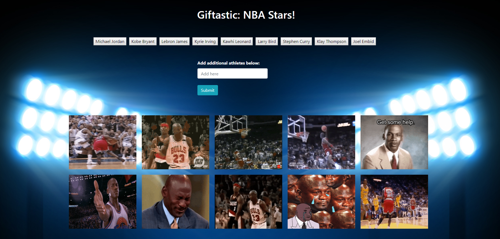

# NBA Giftastic

## Table of contents

- [General info](#general-info)
- [Technologies](#Technologies)
- [Deployment](#Deployment)
- [Authors](#Authors)

## General info

- This website displays ten NBA players GIF's from the GIPHY-API when the user clicks on the corresponding button. 
- You can also create additional NBA player buttons by submitting names in the input box.

- This project utilizes Jquery and the Gifphy API. 

Giftastic Link: https://daneshrewsbury2288.github.io/Giftastic/

## Technologies

Project is created with:

- [HTML](https://developer.mozilla.org/en-US/docs/Web/HTML)
- [CSS](https://developer.mozilla.org/en-US/docs/Web/CSS)
- [JavaScript](https://www.javascript.com/)
- [Jquery](https://jquery.com/)
- [Bootstrap](https://getbootstrap.com/)

## Deployment

Download the repository

- Copy the repo
- Giftastic Link: https://daneshrewsbury2288.github.io/Giftastic/

## Authors

- Dane Shrewsbury

## License

- Open Source
- Created for the University of Washington Code-Boot Camp 2019
